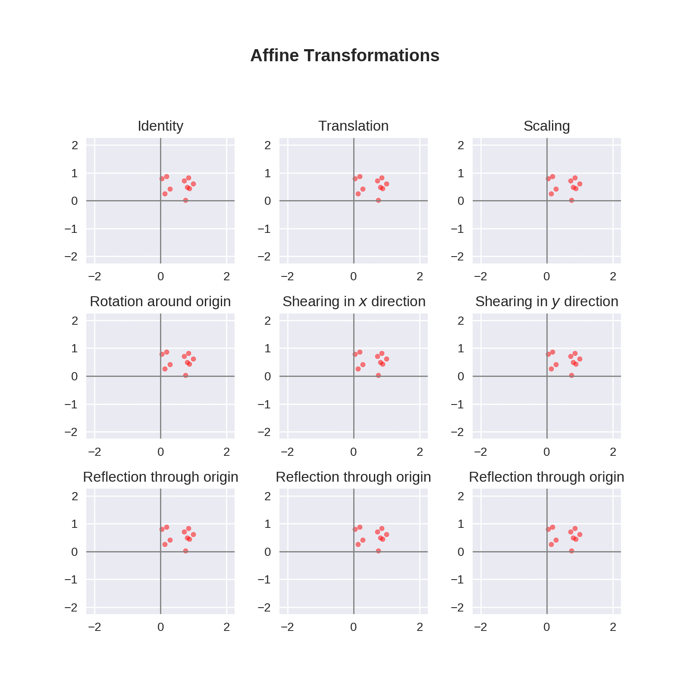
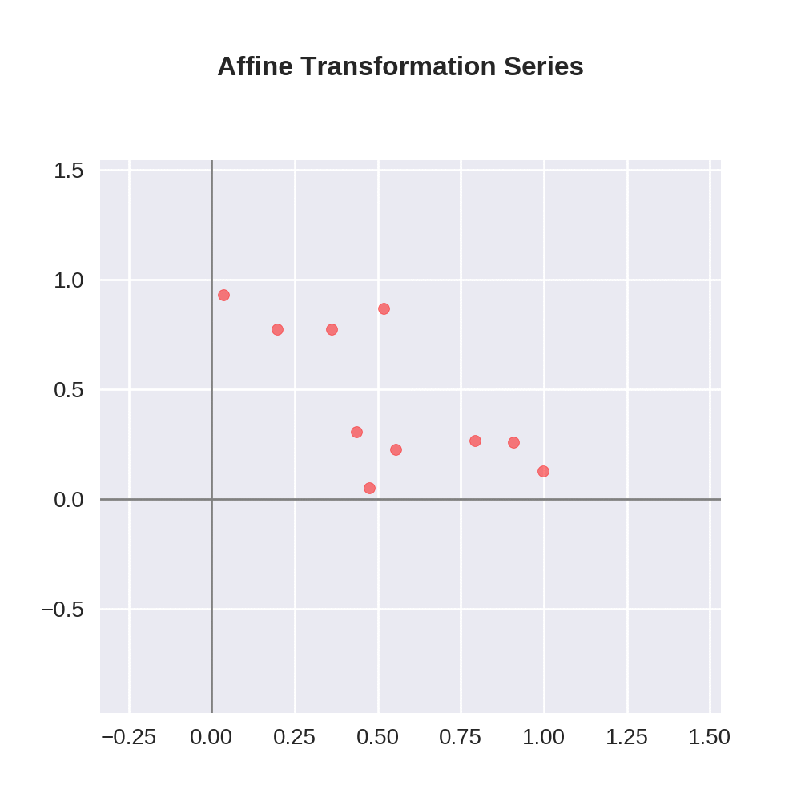

# Avine

Avine is a package for visualizing affine transformations in 2-dimensional Euclidean space. Our documentation is available at
[doc].

<center>
  </img>
</center>

<center>
  </img>
</center>

## Installation

Avine can be installed with

```
pip install git+https://github.com/MinNq/avine.git#egg=avine
```

NumPy and Matplotlib are required. You also need to install [ImageMagick](https://imagemagick.org/index.php) as a gif writer.

[doc]: https://google.com
