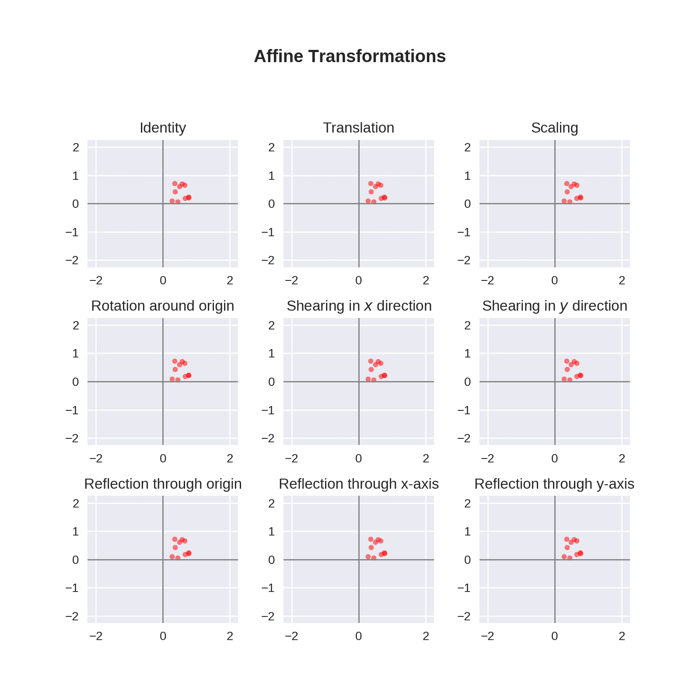

# Avine

Avine is a growing package for visualizing affine transformations in 2-dimensional Euclidean space. In Avine, you can find 
- A useful means for gaining insights into 2-dimensional data.
- An educational tool with beautiful transformation series visualization.
- Shorthand functions for transformation series.

Avine is licensed under the MIT license, which allows reuse without limitation.

Our documentation is available at [minnq.gitbook.io/avine/].

**Examples**

```python
>>> import numpy as np
>>> from avine.Visualize import *
>>> Data = np.random.rand(10, 2)
>>> ShowTransformations(Data, save_at = 'affine-transformations.gif')
```

<center>
  </img>
</center>

```python
>>> import numpy as np
>>> from avine.Visualize import *
>>> Data = np.random.rand(10, 2)
>>> func_list = [(3, 0.2*np.pi), (2, [1.2, 1.5]), (3, -0.2*np.pi)]
>>> ShowSeries(Data, func_list, save_at = 'affine-transformation-series.gif')
```

<center>
  </img>
</center>

## Installation

Avine can be installed directly from its GitHub repository url with

```
pip install git+https://github.com/MinNq/avine.git#egg=avine
```

Additionally, [ImageMagick](https://imagemagick.org/index.php) should also be installed as a gif writer.

[minnq.gitbook.io/avine/]: https://minnq.gitbook.io/avine/
